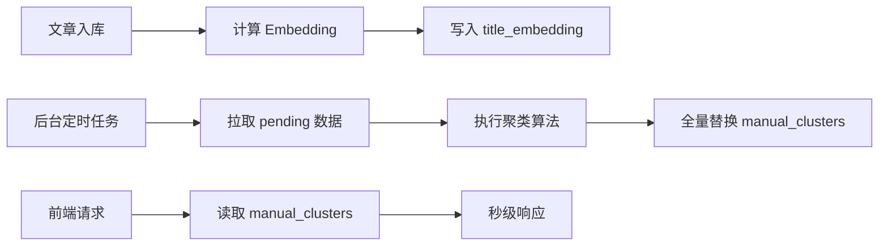

# 预聚类优化方案

## 一、核心痛点

1.  **性能问题**：每次打开控制台或翻页，系统都需"现场"进行聚类，过程缓慢。
2.  **并发阻塞**：系统为单线程阻塞模型，一个耗时操作会卡住所有请求。

---

## 二、解决方案：pgvector + 后台预聚类

### 1. 总体思路

采用**预计算 + 缓存**策略，将 CPU 密集的聚类计算从前端请求链路中剥离：

1.  **向量内置**：在 `manual_reviews` 表中增加 `title_embedding` 字段存储标题向量。
2.  **结果缓存**：新增 `manual_clusters` 表存储预计算好的聚类结果。
3.  **后台任务**：周期性（如每 5 分钟）后台任务负责完成聚类计算并刷新缓存表。

### 2. 数据库设计

#### (A) 扩展 `manual_reviews` 表
新增字段：
-   `title_embedding vector(1024)`

建议索引：
```sql
CREATE INDEX ON manual_reviews USING hnsw (title_embedding vector_l2_ops);
```

#### (B) 新增 `manual_clusters` 表
| 字段                   | 类型        | 说明                               |
| ---------------------- | ----------- | ---------------------------------- |
| `cluster_id`           | text (PK)   | 聚类唯一标识。                     |
| `report_type`          | text        | 报型（zongbao / wanbao）。         |
| `bucket_key`           | text        | 分桶标识（如 internal_positive）。 |
| `representative_title` | text        | 代表性标题。                       |
| `item_ids`             | text[]      | 该聚类包含的文章 ID 列表。         |
| `size`                 | integer     | 文章数量。                         |
| `created_at`           | timestamptz | 生成时间。                         |

---

### 3. 核心流程



1.  **向量化**：文章进入 `manual_reviews` 后，计算标题 Embedding 并存入 `title_embedding` 字段。
2.  **后台聚类**：
    -   从 `manual_reviews` 拉取 `pending` 状态且有向量的数据。
    -   按 `report_type` + `bucket_key` 分组进行聚类。
    -   在一个事务中删除旧记录、写入新结果。
3.  **前端读取**：直接查询 `manual_clusters` 表获取聚类列表。

### 4. API 设计

| 接口                                    | 方法 | 说明                     |
| --------------------------------------- | ---- | ------------------------ |
| `/api/manual_filter/clusters`           | GET  | 返回预计算的聚类列表。   |
| `/api/manual_filter/trigger_clustering` | POST | 手动触发聚类任务刷新。   |

### 5. 风险与应对

| 风险           | 应对措施                                         |
| -------------- | ------------------------------------------------ |
| **分钟级延迟** | 前端显示"最后更新时间"，提供手动刷新按钮。       |
| **并发冲突**   | 使用数据库事务保证更新原子性，避免读到不一致数据。 |